# Data Architecture

This diagram shows the end-to-end data flow for the Fintech Project Delivery Analytics project.

```mermaid
flowchart LR
    subgraph Local["Local Development"]
        Excel["Excel Source Files<br/>fin_data/*.xlsx"]
        Profile["Python Profiling<br/>profile_excel_data.py"]
        Extract["Python Extraction<br/>extract_excel_sheets.py"]
        CSV["Processed CSV Tables<br/>fin_data/processed/*.csv"]
    end

    subgraph GCP["Google Cloud Platform"]
        GCS["Google Cloud Storage<br/>gs://sera-fintech-bucket/raw/csv/"]
        BQRaw["BigQuery Raw Dataset<br/>fintech_raw"]
        BQStaging["dbt Staging Views<br/>fintech_dbt_staging"]
        BQIntermediate["dbt Intermediate Views<br/>fintech_dbt_intermediate"]
        BQMarts["dbt Marts Tables<br/>fintech_dbt_marts"]
    end

    subgraph BI["Business Intelligence"]
        PowerBI["Power BI Dashboard"]
    end

    Excel --> Profile
    Excel --> Extract
    Extract --> CSV
    CSV --> Upload["upload_processed_to_gcs.py"]
    Upload --> GCS
    GCS --> Load["load_gcs_to_bigquery.py"]
    Load --> BQRaw
    BQRaw --> DbtStaging["dbt run --select staging"]
    DbtStaging --> BQStaging
    BQStaging --> DbtIntermediate["dbt run --select intermediate"]
    DbtIntermediate --> BQIntermediate
    BQIntermediate --> DbtMarts["dbt run --select marts"]
    DbtMarts --> BQMarts
    BQMarts --> PowerBI
```



## Layer Responsibilities

| Layer | Location | Responsibility |
| --- | --- | --- |
| Source | Excel files | Original project, task, milestone, employee, department, and country flag data |
| Local processed files | `fin_data/processed/` | CSV table files extracted from Excel with standardized column names |
| GCS raw zone | `gs://sera-fintech-bucket/raw/csv/` | Cloud storage landing zone for raw CSV table files |
| BigQuery raw | `fintech_raw` | Warehouse copy of raw CSV files using explicit schemas |
| dbt staging | `fintech_dbt_staging` | Clean types, parse dates, standardize source fields |
| dbt intermediate | `fintech_dbt_intermediate` | Reusable business logic for task cost, milestone delay, and project performance |
| dbt marts | `fintech_dbt_marts` | Business-ready dimension and fact tables for Power BI |
| Power BI | Dashboard file | Executive and operational reporting layer |

## Execution Order

Run commands from the project root unless noted otherwise.

```powershell
python scripts/profiling/profile_excel_data.py
python scripts/ingestion/extract_excel_sheets.py
python scripts/ingestion/upload_processed_to_gcs.py --credentials-file config/service-account.json
python scripts/ingestion/load_gcs_to_bigquery.py --credentials-file config/service-account.json
```

Then run dbt from `dbt/fintech_analytics`:

```powershell
dbt debug --profiles-dir .
dbt run --select staging --profiles-dir .
dbt test --select staging --profiles-dir .
dbt run --select intermediate --profiles-dir .
dbt test --select intermediate --profiles-dir .
dbt run --select marts --profiles-dir .
dbt test --select marts --profiles-dir .
```